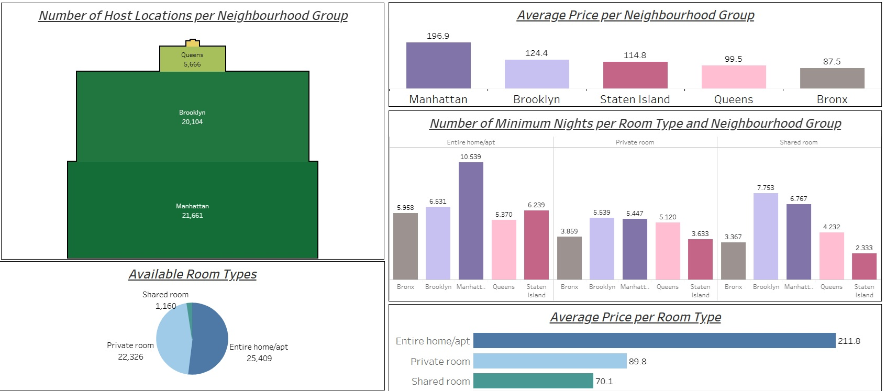
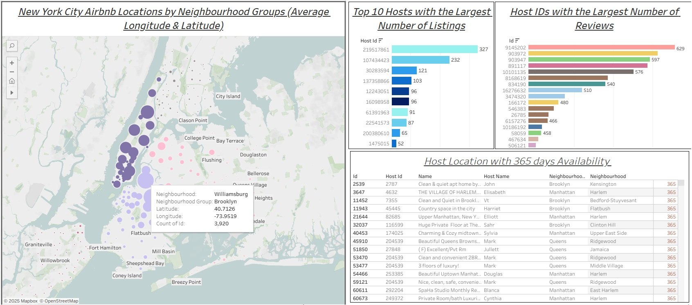

# New York City Airbnb Open Data Analysis 

This project presents a Tableau visualization for analyzing the [New York City Airbnb Dataset](https://www.kaggle.com/datasets/dgomonov/new-york-city-airbnb-open-data) from Kaggle. 
---

## Project Overview

- **Goal**: Analyze the New York City Airbnb Dataset using visuals in Tableau Public.

---

## Dashboards Created:

- The first dashboard displays the general number of Host Locations in each Neighborhood Group (5 groups in general), where the smallest number of Airbnb places are located in Staten Island (only 373). At the same time, Manhattan and Brooklyn are more accommodating for tourists (more than 20,000 places are available). The pie chart with Room Types shows that the most propositions are for Entire home/apt, and the Shared room is the least represented class. The ordering of the Entire home/apt might cost approximately 211.8, the average price of a private room is 89.9, and the shared room cost is 70.1.
The largest average Price is in Manhattan (196.9), and the smallest is in the Bronx (87.5). The minimum nights restriction is over 2 nights on average, the biggest value is observed for Entire home/apt in Manhattan (over 10 nights minimum). 

 


-  The map is present on the second dashboard, which shows the number of places in each Neighborhood of the five groups. The Top 10 Hosts with the biggest number of Listings are displayed using a bar chart to visualize hosts that might not follow peer-to-peer sharing. Also, the Host IDs with the largest number of Left User Reviews are displayed on the visual.
 Additionally, the Host Locations with details available throughout the year are shown in the table.



 

---


## Setup Instructions

### Clone this Repository
```bash
git clone https://github.com/marianaprytula/New_York_City_Airbnb_Open_Data_Analysis-.git
```

### Upload Workbook to Tableau Public (Airbnb_Dataset_Visuals.twbx) or use the following link [Project](https://dub01.online.tableau.com/t/prytulamarianna46-185935c9ad/authoring/Airbnb_Dataset_Visuals/Sheet8/Dashboard%202#1) to open the visuals.